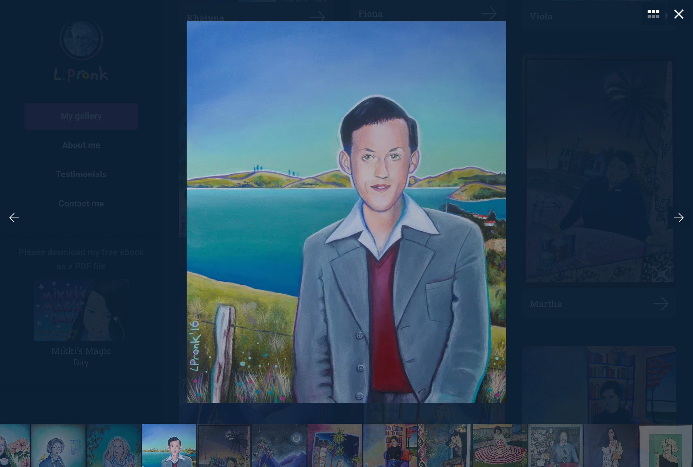
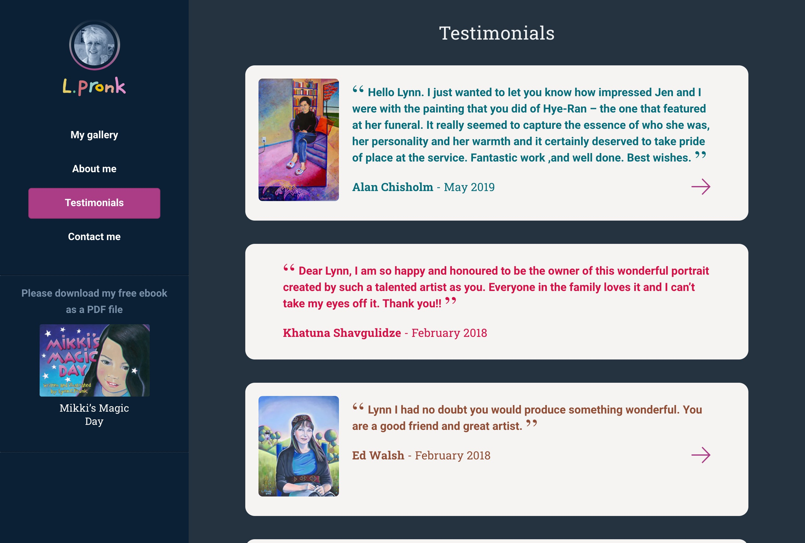
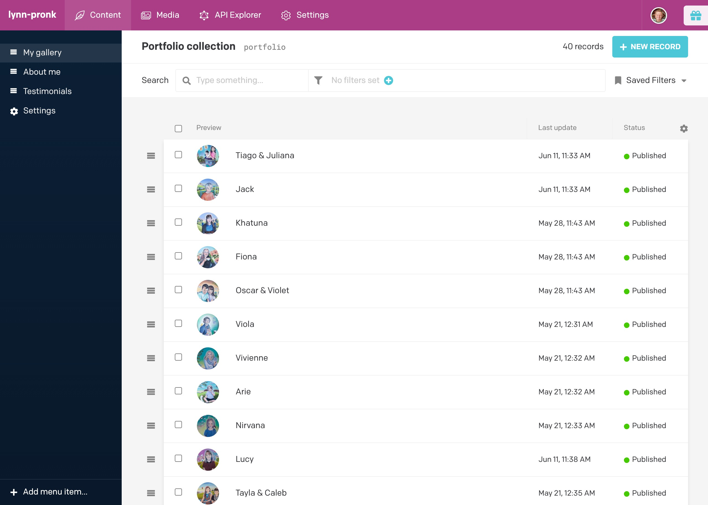
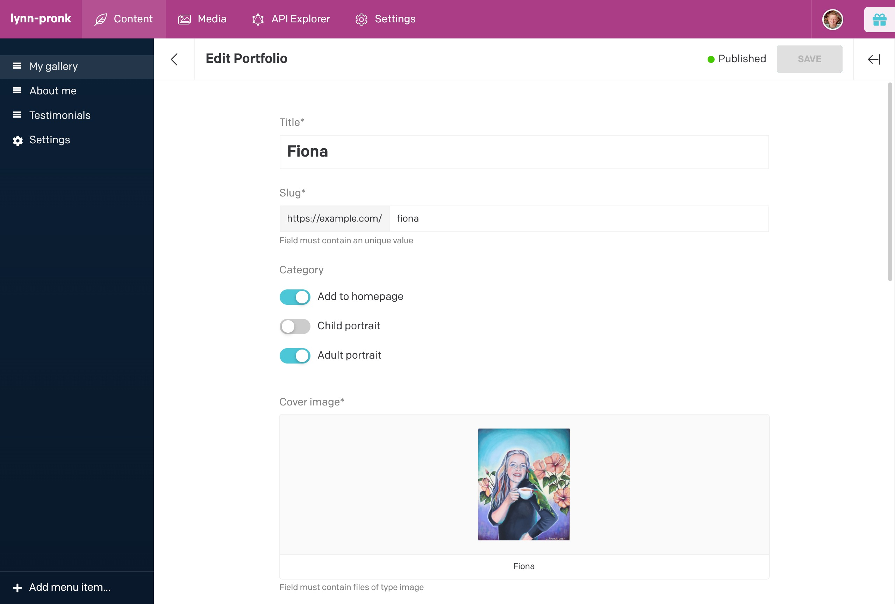

This is a portfolio website designed and built for Lynn Pronk, a portrait artist. Displying the artwork at its best, fitting the browser window where possible was a requst client request. Along with being able to zoom in on images, lazy loading of all imagees is implemented. This allows for quick page loading on the homepage where there are over 40 large images.

The client requested a straight forward, easy to use Content Mangement System (CMS) as the technical skills of the client are prouldly not the best.

